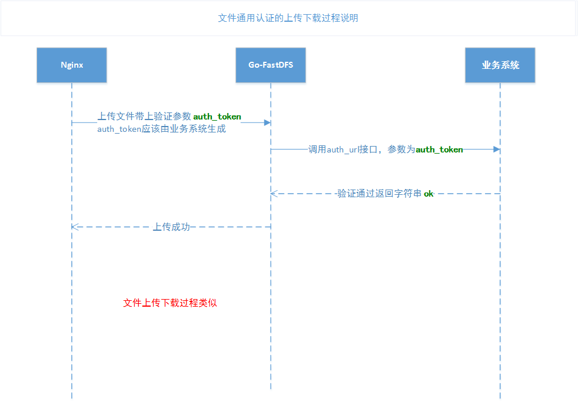
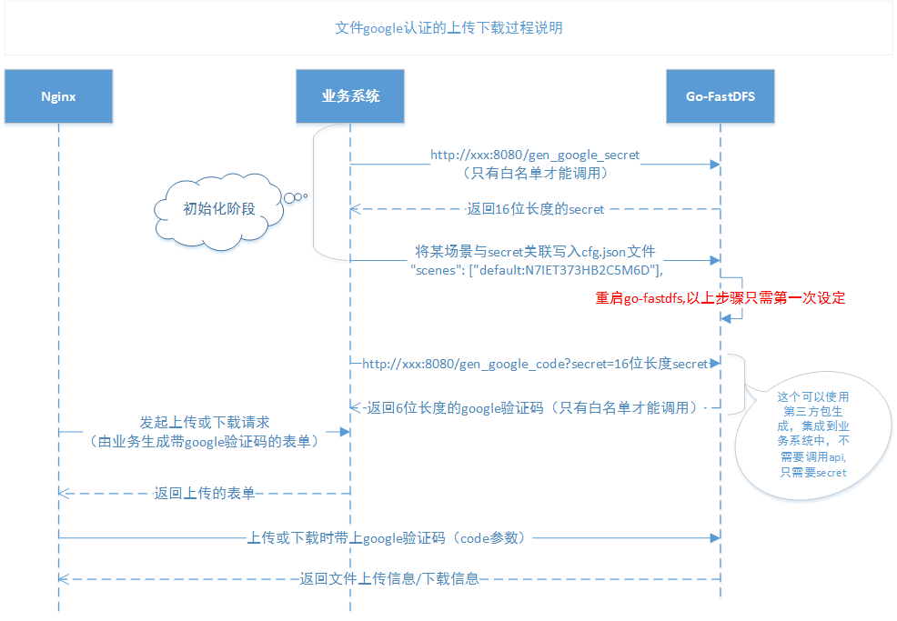

# [中文](README.md) [English](README-en.md)


# go-fastdfs is a distributed file system based on http protocol. It is based on the design concept of avenue to simple. All the simple design makes its operation and expansion more simple. It has high performance, high reliability and no center. , maintenance-free and so on.

### Everyone is worried about such a simple file system. Is it not reliable, can it be used in a production environment? The answer is yes, it is efficient because it is simple, and it is stable because it is simple. If you are worried about the function, then run the unit test, if you are worried about the performance, then run the stress test, the project comes with it, run more confident ^_^.

Note: Please read this article carefully before use, especially [QA](#qa)

- Support curl command upload
- Support browser upload
- Support HTTP download
- Support multi-machine automatic synchronization
- Support breakpoint download
- Support configuration automatic generation
- Support small file automatic merge (reduce inode occupancy)
- Support for second pass
- Support for cross-domain access
- Support one-click migration
- Support for parallel experience
- Support for breakpoint resuming ([tus](https://tus.io/))
- Support for docker deployment
- Support self-monitoring alarm
- Support image zoom
- Support google authentication code
- Support for custom authentication
- Support cluster file information viewing
- Use the universal HTTP protocol
- No need for a dedicated client (support wget, curl, etc.)
- class fastdfs
- High performance (using leveldb as a kv library)
- High reliability (design is extremely simple, using mature components)
- No center design (all nodes can read and write at the same time)

# advantage

- No dependencies (single file)
- Automatic synchronization
- Failure automatic repair
- Convenient maintenance by talent directory
- Support different scenarios
- Automatic file deduplication
- Support for directory customization
- Support to retain the original file name
- Support for automatic generation of unique file names
- Support browser upload
- Support for viewing cluster file information
- Support cluster monitoring email alarm
- Support small file automatic merge (reduce inode occupancy)
- Support for second pass
- Support image zoom
- Support google authentication code
- Support for custom authentication
- Support for cross-domain access
- Very low resource overhead
- Support for breakpoint resuming ([tus](https://tus.io/))
- Support for docker deployment
- Support for one-click migration (migrated from other system file systems)
- Support for parallel experience (parallel experience with existing file system, confirm OK and then one-click migration)
- Support token download token=md5(file_md5+timestamp)
- Easy operation and maintenance, only one role (unlike fastdfs has three roles Tracker Server, Storage Server, Client), the configuration is automatically generated
- Peer-to-peer (simplified operation and maintenance)
- All nodes can read and write simultaneously


#Start the server (compiled, [download](https://github.com/sjqzhang/fastdfs/releases) experience)
```
./fileserver
```


#Command upload

`curl -F file=@http-index-fs http://10.1.xx.60:8080/upload`


# WEB upload (browser open)

`http://127.0.0.1:8080`

#Code upload (options see browser upload)
## python
```python
import requests
url = 'http://127.0.0.1:8080/upload'
files = {'file': open('report.xls', 'rb')}
options={'output':'json','path':'','scene':''} #See browser upload options
r = requests.post(url, files=files)
print(r.text)
```
## golang
```go
package main

import (
	"fmt"
	"github.com/astaxie/beego/httplib"
)

func main()  {
	var obj interface{}
	req:=httplib.Post("http://10.1.5.9:8080/upload")
	req.PostFile("file","path/to/file")
	req.Param("output","json")
	req.Param("scene","")
	req.Param("path","")
	req.ToJSON(&obj)
	fmt.Print(obj)
}
````

## java

```xml
<dependency>
	<groupId>cn.hutool</groupId>
	<artifactId>hutool-all</artifactId>
	<version>4.4.3</version>
</dependency>
```

```java
public static void main(String[] args) {
    File file = new File("D:\\git\\2.jpg");
    HashMap<String, Object> paramMap = new HashMap<>();
    paramMap.put("file", file);
    paramMap.put("output","json");
    paramMap.put("path","image");
    paramMap.put("scene","image");
    String result= HttpUtil.post("http://xxxxx:xxxx/upload", paramMap);
    System.out.println(result);
}
```

# Breakpoint resume example
## golang
```go
package main

import (
    "os"
    "fmt"
    "github.com/eventials/go-tus"
)

func main() {
    f, err := os.Open("100m")
    if err != nil {
        panic(err)
    }
    defer f.Close()
    // create the tus client.
    client, err := tus.NewClient("http://10.1.5.9:8080/big/upload/", nil)
    fmt.Println(err)
    // create an upload from a file.
    upload, err := tus.NewUploadFromFile(f)
    fmt.Println(err)
    // create the uploader.
    uploader, err := client.CreateUpload(upload)
    fmt.Println(err)
    // start the uploading process.
   fmt.Println( uploader.Upload())

}
````
[more langue](doc/upload.md)


Universal file authentication timing diagram


File google authentication timing diagram


# Please click [Feedback](https://github.com/sjqzhang/go-fastdfs/issues/new)


# Q&A
- Best practice?
```
First, if it is mass storage, do not open the file token authentication function to reduce performance.
Second, try to use the standard upload, upload the business to save the path, and then connect the domain name when the business is used (convenient migration extension, etc.).
Third, if you use breakpoints to continue transmission, you must use the file id to replace the path storage after uploading (how to replace the QA/API document), to reduce performance for subsequent access.
Fourth, try to use physical server deployment, because the main pressure or performance comes from IO
Fifth, the online business should use the nginx+gofastdfs deployment architecture (the equalization algorithm uses ip_hash) to meet the later functional scalability (nginx+lua).
Sixth, the online environment is best not to use container deployment, the container is suitable for testing and functional verification.
Summary: The path of the file saved by the business reduces the conversion of the later access path, and the file access permission is completed by the service, so that the performance is the best and the versatility is strong (can be directly connected to other web servers).

Important reminder: If the small file merge function is enabled, it is impossible to delete small files later.
Upload result description
Please use md5, path, scene field, others are added to be compatible with the old online system, and may be removed in the future.

```
- In the WeChat discussion group, everyone asked about the performance of go-fastdfs?
```
Because there are too many people asking, answer here in unison.
The file location of de-fastdfs is different from other distributed systems. Its addressing is directly located without any components, so the approximate time complexity is O(1)[file path location]
There is basically no performance loss. The project also has a pressure test script. You can carry out the pressure test yourself. Don’t discuss the problem too much in the group. People reply to the same question every time.
Everyone will also feel that this group is boring.
```


- Can files already stored using fastdfs be migrated to go fastdfs?
```
The answer is yes, the problem you are worried about is the path change, go fastdfs considers this for you.

Curl -F file =@data/00/00/_78HAFwyvN2AK6ChAAHg8gw80FQ213.jpg -F path = M00 / 00/00 / http://127.0.0.1:8080/upload

Similarly, all files can be migrated with one line of command.

Cd fastdfs / data && find -type f | xargs -n 1 -I {} curl -F file = @ data / {} -F path = M00 / 00/00 / http://127.0.0.1:8080/

The above commands can be moved rough
Can write some simple scripts for migration

```

- What is a cluster, how to manage multiple clusters with Nginx?
```
1, in the go-fastdfs, a cluster is a group.
2, please refer to the deployment diagram
Note: When the support_group_manage parameter in the configuration is set to true, group information is automatically added to all urls.
For example: HTTP://10.1.5.9:8080/group/status
Default: HTTP://10.1.5.9:8080/status
The difference: more group, corresponding to the group parameter in the configuration, so mainly to solve a Nginx reverse proxy multiple groups (cluster)
Please refer to the deployment diagram for details.

```


- How to build a cluster?
```
First, download the compiled executable file (with the latest version)
Second, run the executable file (generate configuration)
Third, modify the configuration
Peer: increase the peer's HTTP address
an examination:
Moderator: Is the automatic generation correct?
Peer_id: Is it unique within the cluster?
Fourth, re-run the server
Five, verify that the service is OK
```


- Is it suitable for mass storage?
```
Answer: Suitable for mass storage
Special Note:
Need to use LevelDB as metadata storage, but not relying on lazy LevelDB,
And carry out more than 100 million documents for pressure measurement (you can use the script provided by the project to perform pressure measurement, and have problems and feedback to the problem in time).
100 million file metadata size is about 5G, export metadata text size 22G

```


- Need to install nginx yet?
```
Can not be installed, you can also choose to install
Go fastdfs itself is a high performance web file server.
```

- Can I dynamically load the configuration?
```
Answer: Yes, but update to the latest version
step:
1) Modify the conf / cfg.json file
2) Visit http://10.1.xx.60:8080 / reload
3) Note: each node needs to do the same operation
```


- What is the memory usage high?
```
Under normal circumstances, the memory should be lower than 2G, unless more than one million files are uploaded every day.
The memory is abnormal, mainly because the files of the cluster are not synchronized, and the automatic repair function is enabled.
Solution, delete the errors.md5 file on the day of the data directory, close the automatic repair, restart the service
See system status description

```

- How to view cluster file information?
```
HTTP://10.1.xx.60:8080/stat

What should I do if there is a file error?
Please delete the stat.json file in the data directory to restart the service. Please recalculate the number of files automatically.

Or call
HTTP://10.1.xx.60:8080/repair_stat

```
- How reliable can it be used in a production environment?
```
This project has been used on a large scale in the production environment, such as fear of not meeting
You can stress test its features before use, any
The problem can directly ask the question
```

- Can I have multiple servers on one machine?
```
No, the high availability of the cluster has been considered at the beginning of the design. In order to ensure the true availability of the cluster, it must be different for ip, ip cannot use 127.0.0.1.
Error "peer": ["http://127.0.0.1:8080","http:// 127.0.0.1:8081","http:// 12.7.0.0.1:8082"]
Correct "peer": ["http://10.0.0.3:8080","http://10.0.0.4:8080","http://10.0.0.５:8080"]

- If you have any questions, please click [Reply](https://github.com/sjqzhang/go-fastdfs/issues/new)


